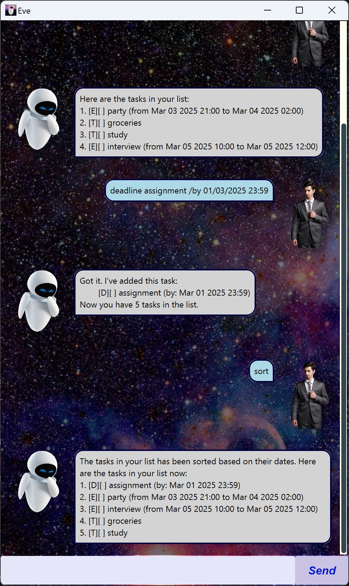

# Eve User Guide



Eve is a personal assistant that frees your mind of having to remember things you need to do. It's:
- Text-based
- Easy to learn
- ~~FAST~~ SUPER FAST to use

## Quick Start

1. Ensure you have Java 17 or above installed on your computer.
1. Download the latest Meep.jar file from the [releases page](https://github.com/tata32000/ip/releases).
1. Double-click the downloaded Meep.jar file to launch the application. If that does not work, open a terminal and run
   `java -jar Meep.jar`.

## Features
### Adding todo task
To add a simple todo task, use the `todo` command followed by the task description.

Example: `todo groceries`

Eve will confirm the task is added with a message:
```
Got it. I've added this task:
    [T][ ] groceries
Now you have 1 tasks in the list.
```

### Adding deadline
To add a deadline, use the `deadline` command followed by the task description and 
due date.

Example: `deadline assignment /by 23/01/2025 23:59`

Eve will confirm the task is added with a message:
```
Got it. I've added this task:
    [T][ ] assignment (by: Jan 23 2025 23:59)
Now you have 1 tasks in the list.
```

### Adding event
To add an event, use the `event` command followed by the task description as well
as start and end times.

Example: `event party /from 23/01/2025 21:00 /to 23/01/2025 23:30`

Eve will confirm the task is added with a message:
```
Got it. I've added this task:
    [T][ ] party (from Jan 23 2025 21:00 to Jan 23 2025 23:30)
Now you have 1 tasks in the list.
```

### Delete task
To delete a task from the task list, use the `delete` command followed by the task number.

Example: `delete 1`

### Find tasks
To find tasks with matching description, use the `find` command followed by the 
description to look for.

Example: `find study`

### View all tasks
To view all tasks saved in task list, use the `list` command.

Example: `list`

### Mark task as done
To mark a task as done, use the `mark` command.

Example: `mark 1`

### Unmark task 
To unmark a task as not done, use the `unmark` command.

Example: `unmark 1`

### Exit program
To end the interaction with Eve, use the `bye` command followed by `close` command.
